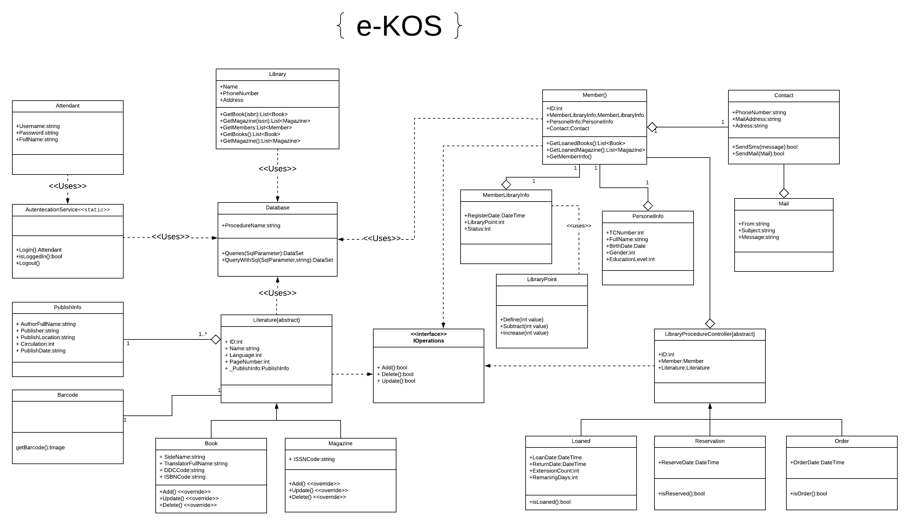
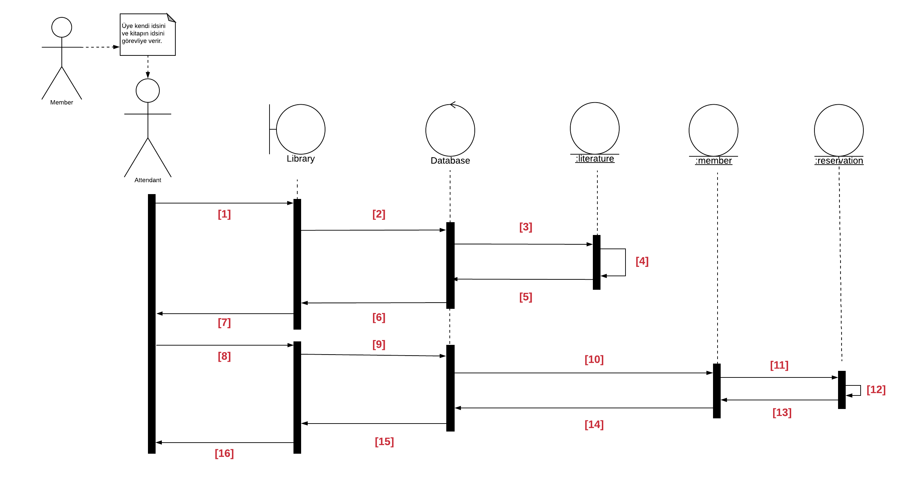

# Library-Management
e-KOS Project (Created By [Ardanuc Akar](https://github.com/ArdanucAKAR) &amp; [Volkan Kahraman](https://github.com/volkankahraman))

Döküman : https://docs.google.com/document/d/1ETJTrYptOci3vz-bvnwCZTBgBnLFEYZvGil6AdVeWak/edit?usp=sharing
### Projenin Amacı :

Projemizin amacı, tüm kütüphaneler için kitapların ve dergilerin stoklarının tutulmasını, yeni üye alımını, ödünç verilen kitapların takibini ve gerektiğinde rezervasyon gibi işlemlerin kolayca yapabileceği sunucu destekli bir sistemin ortaya konmasıdır.
# Uml Diyagramı

# Squence Diyagramı

# Terminoloji

-   ISBN : Amaç, kitap numaralarının uluslararası bir yöntemle düzenlenerek standardize edilip, Uluslararası Standart Kitap Numarası (ISBN) verilerek belirli bir yayımcının yayınladığı bir materyalin kimliğini tanımlamaktır.
    

  

-   ISSN : Amaç, dergi numaralarının uluslararası bir yöntemle düzenlenerek standardize edilip, Uluslararası Standart Seri Numarası (ISSN) verilerek belirli bir yayımcının yayınladığı bir materyalin kimliğini tanımlamaktır.
    

  

-   Demirbaş Numarası (ID) : Amaç, kütüphane envanterinde bulunan materyallerin takip edilmesi için materyalin kimliğini tanımlamaktır.
    

  

-   Tasnif Numarası :  Kütüphanelerdeki bilgi kaynaklarına kolayca ulaşabilmek [i](http://www.nuveforum.net/1727-genel-kultur-k/68552-kutuphane-kullanilir/)çin, aynı konuda bilgi [i](http://www.nuveforum.net/1727-genel-kultur-k/68552-kutuphane-kullanilir/)çeren bütün kitapların aynı yerde bulunmasını sağlayan, okurların istedikleri kitabı kolayca seçmelerine olanak veren sistemlerdir.
    

  

-   DDC Kodu : Melvil Dewey’in 1876’da başlattığı dünyaca yaygın bir sistem olan, bilgilerin 10 anasınıfta toplandığı ondalık sisteme dayalı kütüphane sınıflandırma sistemidir.Ülkemizde tasnif numarası olarak bilinmekte olup farklı sınıflandırma türleri de vardır.
    

  
-  Barkod : Çubuk kod ya da çizgi im, verilerin görsel özellikli makinelerin okuyabilmesi için çeşitli kodlama yöntemleriyle sunulmasıdır.Projede demirbaş numarası veya isbn ve issn numaraları için kullanılması düşünülmektedir.
# Gereksinimler

  

#### İşlevsel Olan Gereksinimler :

1.  Kütüphane görevlisi giriş panelinde kullanıcı adı ve şifresini girerek giriş yapabilmeli
    
2.  Kütüphane görevlisinin yönetim panelinden isbn ve ya issn kullanarak kitap bilgilerini sunucudan çekip, kitap ekleme işlemi yapabilmeli
    
3.  Kütüphane görevlisi yönetim panelinden eklediği kitap bilgilerini düzenleyebilmeli ve kitapları silebilmeli.
    
4.  Kütüphane görevlisinin bir kitabı yönetim panelinden isbn, issn, eser adı, yazar, yayınevi veya çevirmen bilgilerini kullanarak veritabanı üzerinden arayabilmesi.
    
5.  Kütüphane görevlisi aradığı kitabı seçtiği bir üyeye ödünç verebilmesi
    
6.  Kütüphane görevlisi aradığı kitabı seçtiği bir üyeye rezerve edebilmeli ve düzenliyip iptal edebilmeli.
    
7.  Kitap siparişi yapıp bunu sistem üzerinden takip edip değiştirebilmesi ve iptal edebilmesi.
    

  

### İşlevsel Olmayan Gereksinimler :

1.  Web platformunda çalışır olmalı.
    
2.  Güncel tüm browserların desteklenmesi sağlanmalı.
    
3.  Responsive bir tasarım olmalı.
    
4.  Sistemin çevrimdışı da çalışabilmesi.

w/ [Ardanuc Akar](https://github.com/ArdanucAKAR)
